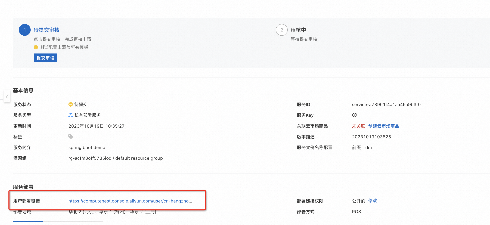
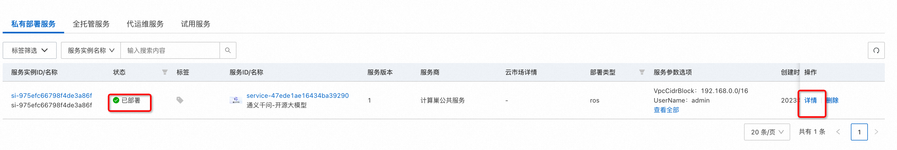

# 服务模版说明文档

## 服务说明

本文介绍基于通义单机gpu实例ecs服务快速上手流程，本示例对应的[git地址](https://github.com/aliyun-computenest/tongyi-chat-demo)

本示例会自动的构建计算巢服务，具体的服务构建流程为
1. OOS ACS-ECS-UpdateImage模版执行命令构建ecs镜像
2. 通过构建好的ecs镜像创建ECS镜像部署物并完成分发
3. 创建计算巢服务并关联镜像部署物

创建过程大约持续50分钟，当服务变成待提交后构建成功

## 部署架构

本部署架构为单机ecs部署，通过公网ip 8080端口访问


## 服务构建计费说明

测试本服务构建需要支付构建镜像过程中的ECS费用，请确保账号中有足够的余额，创建服务实例涉及的费用参考服务实例计费说明

## RAM账号所需权限


本服务需要对ECS、VPC等资源进行访问和创建操作，若您使用RAM用户创建服务实例，需要在创建服务实例前，对使用的RAM用户的账号添加相应资源的权限。添加RAM权限的详细操作，请参见[为RAM用户授权](https://help.aliyun.com/document_detail/121945.html)。所需权限如下表所示。

| 权限策略名称                          | 备注                     |
|---------------------------------|------------------------|
| AliyunECSFullAccess             | 管理云服务器服务（ECS）的权限       |
| AliyunVPCFullAccess             | 管理专有网络（VPC）的权限         |
| AliyunROSFullAccess             | 管理资源编排服务（ROS）的权限       |
| AliyunComputeNestUserFullAccess | 管理计算巢服务（ComputeNest）的用户侧权限 |
| AliyunComputeNestSupplierFullAccess | 管理计算巢服务（ComputeNest）的服务商侧权限 ｜

## 服务实例计费说明

测试本服务在计算巢上的费用主要涉及：

- 所选vCPU与内存规格
- 系统盘类型及容量
- 公网带宽

计费方式包括：

- 按量付费（小时）
- 包年包月
预估费用在创建实例时可实时看到。


## 部署流程


### 部署参数说明

    | 参数组 | 参数项 | 示例 | 说明 |
    | --- | --- | --- | --- |
    | 服务实例名称 |  | test | 实例的名称 |
    | 地域 | 部署地域 | 新加坡 | 选中服务实例的地域，因为一些模型在国内无法下载访问，建议选择中国香港或海外地域 |
    | 可用区配置 | 部署区域 | 可用区I | 地域下的不同可用区域 |
    | 付费类型配置 | 付费类型 | 按量付费 或 包年包月 |  |
    | ECS实例配置 | 实例类型 | ecs.gn6i-c4g1.xlarge | 实例规格，可以根据实际需求选择 |
    | ECS实例配置 | 实例密码 |  | 设置实例密码。长度8，30个字符，必须包含三项（大写字母、小写字母、数字、()`!@#$%^&*-+={}[]:;'<>,.?/ 中的特殊符号） |
    | 登录信息 | 软件登录名 | admin | 设置软件登录名，默认为admin |
    | 登录信息 | 软件登录名密码 |  | 设置软件登录密码 |
    | 网络配置 | 专有网络IPv4网段 | 192.168.0.0/16 | VPC的ip地址段范围 |
    | 网络配置 | 交换机子网网段 | 192.168.0.0/24 | 交换机子网网段 |                                                       |

### 部署步骤

1. 登录阿里云计算巢控制台找到对应的服务点部署链接进入部署
    
    

2. 勾选我已阅读并同意《计算巢服务协议》，点击"立即创建"按钮。
   
   

3. 查看部署进度。 点击去列表页查看，可以看到刚刚创建的服务实例以及服务部署进度。
    

4. 访问等待状态变为"已部署"后，点击详情，进入对应的服务实例后，可以在页面上获取Endpoint以访问服务。
    

5. 点击Endpoint后面的链接，输入第1步设置的软件登录名及密码。
    

6. 完成验证后即可访问：
    


## 服务详细说明

基于ecs镜像的部署流程详细参见springboot ecs单机版构建，本文只介绍gpu和软件构建的具体步骤

1. ecs构建基于gpu镜像执行命令 安装基础环境和git下载软件，配置在config.yaml中
```bash
      # openssl
      wget https://www.openssl.org/source/openssl-1.1.1n.tar.gz --no-check-certificate
      tar -zxvf openssl-1.1.1n.tar.gz
      cd openssl-1.1.1n
      ./config --prefix=/usr/local/openssl
      make -j && make install
      openssl version
      ln -s /usr/local/openssl/bin/openssl /usr/bin/openssl
      sudo ldconfig
      export LD_LIBRARY_PATH=/usr/local/openssl/lib:$LD_LIBRARY_PATH
      cd .. && rm -rf openssl-1.1.1n.tar.gz

      # 安装python3.8.6

      cd /usr/local/
      wget https://www.python.org/ftp/python/3.8.6/Python-3.8.6.tgz --no-check-certificate
      tar -zxvf Python-3.8.6.tgz && rm -f Python-3.8.6.tgz
      cd /usr/local/Python-3.8.6/
      ./configure --prefix=/usr/local/python3 --with-openssl=/usr/local/openssl --with-openssl-rpath=auto
      yum install -y libffi-devel zlib zlib-devel bzip2-devel
      yum install -y xz-devel
      yum install -y python-backports-lzma
      yum install -y lzma
      yum install -y libX11
      yum install -y libXext
      make && make install

      echo 'export PATH="/usr/local/python3/bin:$PATH"' >> /root/.bashrc
      source /root/.bashrc

      # 安装git
      yum install -y https://packages.endpointdev.com/rhel/7/os/x86_64/endpoint-repo.x86_64.rpm
      yum install -y git

      # 安装tongyi
      cd /root
      git clone https://www.modelscope.cn/studios/qwen/Qwen-14B-Chat-Demo.git

      # 依赖环境
      pip3 install gradio
      pip3 install torch
      pip3 install modelscope
      pip3 install transformers
      pip3 install tiktoken
      pip3 install transformers_stream_generator
      pip3 install accelerate

      # 启动预下载模型
      mkdir -p /root/.cache/modelscope/hub/qwen
      wget https://computenest-data-ap-southeast-1.oss-ap-southeast-1-internal.aliyuncs.com/qwen/Qwen-14B-Chat.tar
      tar xvf Qwen-14B-Chat.tar && mv Qwen-14B-Chat  /root/.cache/modelscope/hub/qwen/


      cd Qwen-14B-Chat-Demo
      python3 app.py > /var/log/app.log &

      for ((i=0;i<1000;i++))
      do
         curl 127.0.0.1:7860 > /tmp/health_check
         if [ "$?" == 0 ]
         then
           break
         fi
         sleep 10
      done
```

2. 在template.yaml配置软件启动时根据UserName和Password配置systemctl并给nginx配置账号密码放到/etc/nginx/password中，最终通过systemctl拉起tongyi服务
```yaml
  CommandContent:
    Fn::Sub:
      # 将master的ip输入到/root/conf.txt
      # 可以在后续的步骤中通过conf.txt里的内容完成slave的初始化
      - |
        #!/bin/bash
        cat > /lib/systemd/system/tongyi.service << "EOF"
        [Unit]
        Description=TongYi Model App
        After=network-online.target
        Wants=network-online.target
        [Service]
        ExecStart=/bin/bash -c "cd /root/Qwen-14B-Chat-Demo && python3 app.py"
        Restart=on-abnormal
        LimitNOFILE=60000
        TimeoutSec=120
        [Install]
        WantedBy=multi-user.target
        EOF

        cat > /etc/nginx/conf.d/5000.conf <<"EOF"
        server {
            listen       5000;
            server_name  _;
            root         /usr/share/nginx/html;

            # Load configuration files for the default server block.
            include /etc/nginx/default.d/*.conf;

            auth_basic "请输入用户和密码"; # 验证时的提示信息
            auth_basic_user_file /etc/nginx/password; # 认证文件

            location / {
            proxy_pass http://127.0.0.1:7860/;
            proxy_http_version 1.1;
            proxy_set_header Upgrade $http_upgrade;
            proxy_set_header Connection Upgrade;
          }
            error_page 404 /404.html;
            location = /404.html {
          }

            error_page 500 502 503 504 /50x.html;
            location = /50x.html {
          }
        }
        EOF

        systemctl daemon-reload
        systemctl enable tongyi
        systemctl start tongyi
        systemctl status tongyi

        for ((i=0;i<1000;i++))
        do
           curl 127.0.0.1:7860
           if [ "$?" == 0 ]
           then
             break
           fi
           sleep 10
        done
        htpasswd -bc /etc/nginx/password ${UserName} '${Password}'
        systemctl start nginx
        systemctl status nginx
        systemctl enable nginx
        # 执行成功回调WaitCondition结束waitCondition的等待
        ${CurlCli} -d "{\"Data\" : \"Success\", \"status\" : \"SUCCESS\"}"
      - UserName:
          Ref: UserName
        Password:
          Ref: Password
        # 获取到waitConditionHandle的地址放到 ${CurlCli}变量里
        CurlCli:
          Fn::GetAtt:
            - WaitConditionHandle
            - CurlCli
```

## 其他说明

[实例代码源地址](https://www.modelscope.cn/studios/qwen/Qwen-14B-Chat-Demo)

